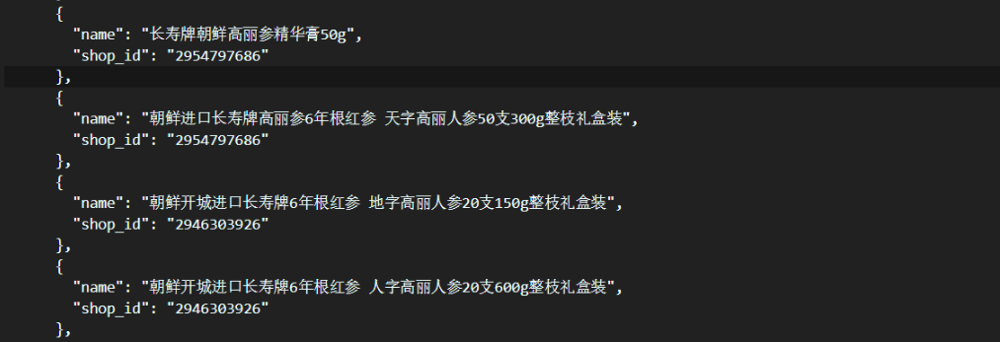

# 大数据项目三：面向淘宝数据的大数据系统构建  

> 陈俊儒	孙伟杰	林泽钦


[TOC]

## 概述

这次项目我们对 "天猫国际部分店铺商品数据集" 进行处理以及分析，完成了销售额统计、商品归类、商品销售量分类统计、店铺归类、店铺销量分类统计、标签云、相似推荐以及情感分析等任务，并通过可视化工具将分析的结果展示在网页上。

## 数据处理

### 1 -- 销售额统计

项目提供的数据为 json 格式，我们使用 python 进行内容提取。对于各个商品，需要提取的内容为：月销量、当前价格、邮费以及进口税。由此得到的销售额为：(当前价格 + 邮费 + 进口税) * 月销量。由于并不是每个商品都具有全部这些属性，所以当某个属性缺失的时候，我们直接设置为 0.0。此外需要注意的事项为：

__邮费__

对 json 文件进行遍历探索之后，我们发现邮费 (postage) 可能的格式为：

+ 包邮
+ 上门安装
+ 邮费：xx.xx
+ 快递：xx.xx
+ 运费：xx.xx

对于前两种，邮费应当设置为 0.0；对于其它格式，只需将数字提取出来即可。

__进口税__

商品税 (tariff) 可能的格式以及相应的处理方式为：

|             格式             |      进口税数额       |
| :--------------------------: | :-------------------: |
|     进口税: 预计xx.xx元      |        $xx.xx$        |
| 进口税: 预计xx.xx - yy.yy元  | $(xx.xx + yy.yy) / 2$ |
| 进口税: xx% 如需征收买家承担 |  $price * xx / 100$   |
|     进口税: 买家自行承担     |          $0$          |
|           商家包税           |          $0$          |
|           商家承担           |          $0$          |

下面展示了简化版本的代码。

```python
tariff_pattern_1 = re.compile(r"进口税: 预计(?P<tariff>[0-9]+.[0-9]+)元")
tariff_pattern_2 = re.compile(r"进口税: 预计(?P<tariff_low>[0-9]+.[0-9]+) - (?P<tariff_high>[0-9]+.[0-9]+)元")
tariff_pattern_3 = re.compile(r"进口税: (?P<percent>[0-9]+.[0-9]+)% 如需征收买家承担")

for file_name in files:
    file_path = r"./data/" + file_name
    with open(file_path, "r", encoding = "utf-8") as load_f:
        load_data = json.load(load_f)
    
    for i in range(0, item_num):
        # 商品名称
        if "name" in items[i]:
            item_name[i] = items[i]["name"]
        # 商品价格
        if "price" in items[i]:
            if items[i]["price"] is not None:
                item_price[i] = items[i]["price"]
        # 商品邮费
        if "postage" in items[i]:
            if r"包" in items[i]["postage"]:            # 包邮
                item_postage[i] = 0.0
            elif items[i]["postage"] == r"上门安装":    # 上门安装
                item_postage[i] = 0.0
            else:                                       # 邮费: xx.xx
                item_postage[i] = float(items[i]["postage"][4:])
        # 商品销量
        if "sales" in items[i]:
            # 月销量 xxxx件
            item_sales[i] = int(items[i]["sales"][4:-1])
        # 商品进口税
        if "tariff" in items[i]:
            # 进口税: 预计xx.xx元
            obj = tariff_pattern_1.search(items[i]["tariff"])
            if obj:
                item_tariff[i] = float(obj.group("tariff"))
            # 进口税: 预计xx.xx - xx.xx元
            obj = tariff_pattern_2.search(items[i]["tariff"])
            if obj:
                item_tariff[i] = (float(obj.group("tariff_low")) + float(obj.group("tariff_high")))/2
            # 进口税: xx% 如需征收买家承担
            obj = tariff_pattern_3.search(items[i]["tariff"])
            if obj and item_price[i] > 0:   # 价格不为空
                item_tariff[i] = item_price[i] * float(obj.group("percent")) / 100
```

最后对每个商店，我们将其所有商品销售额累加得到商店的销售额，然后保存为 json 文件以供可视化使用。部分结果展示如下：


---


### 2-7 -- 聚类与标签

由于2-7个任务是连贯进行的，代码基本是在一个流程图里，并且顺序也和题目顺序不太一样。我们将按照我们的实现流程来梳理我们对着几个问题的解决过程。

总的说来，这几个任务全是在解析`JSON`文本筛选并生成新的信息文本的前提下，对不同的任务采取不同的信息段拼接，提取关键词函数和文本聚类函数均是利用`Hanlp`库自带的函数实现的，根据结果来看，我们对数据信息的提取与甄别是非常到位的，效果比想象中的还要好不少。

大致流程是：

- 过滤`JSON`源文件，利用分隔符分段筛选信息，生成新的过滤文本。
- 按照不同店铺文件逐行扫描整个过滤文本，将关键词文本、店铺聚类文本、商品聚类文本分为提取并将后两者存储在词典中。
- 在每个店铺文件结尾，立即对这个店铺进行关键词提取，为了生成标签云，提取前100个关键词存入词典，同时将前五个关键词存在词典中，方便最后的统一输出，再将前十个关键词分为乘以5次添加到店铺聚类文本中，因为我们认为关键词非常有区分度，能够辅助后续任务的完成。
- 由于我们在可视化过程中将每个店铺信息分别展示，因此这里在第一题得出的`JSON`数据下，将前五个关键词添加到末尾，作为新的显示文本。
- 标签云则是根据每个店铺生成的前100个关键词累加之后，按照总次数由高到低排列，输出前100个关键词。
- 店铺聚类与商品聚类非常类似，均是利用之前已经添加好的文本，直接调库函数进行聚类，反复尝试后，最终决定自己手动设定类别数量，之后再人工筛查，删除效果不好的类别，并根据关键词总结归纳类别的名称。

#### 2-7.1  过滤文本

这部分算是花功夫最多的部分，一开始我们将

> 店铺名、商品名、副标题、商品信息、评论标签、评论精选内容

全部纳入数据，但提取的关键词非常差，大多是`好`、`不错`这样的语气词，因此，我们认为评论部分并不能反映出一家店具体卖什么，或者类似的硬标签，评论只能分析出商品质量好坏、服务态度或者物流速度等软标签，因此我们决定将这部分内容删除。

在进一步尝试后，发现不论怎么提取关键词，总会出现一些很普通的词语，比如`质量`、`材质`一类的词语，究其根源，是商品信息中不仅仅是有效内容，还混杂着大量的属性名称，因此，我们采取人工抽取源数据，手动添加过滤关键词去屏蔽这些属性名。在进一步测试后，出现在关键词或者聚类结果中，发现效果很差的店铺，我们又会返回寻找干扰词，好在总的类别不算多，几次修改后能够达到较好的效果。

```python
attr_jump = re.compile(r'商品信息|材质|成分|质地|弹力|填充|同款|(其他|是|否)|上市|年份|季节|裙长|吊牌图|销售|厚薄|款式|版型|领型|工艺处理|查看更多|风格|适用|面料|服饰工艺|安全等级|品牌|产地|净含量|产品|包装方式|条形码|形状|功效|保质期|生产企业|计价单位|口味|气味|规格|功能|量贩装|种类|闭合方式|货号|鞋帮高度')
```

另一方面，在商品副标题中，我们发现也不总是有用的附加信息，经常也会出现`优惠活动`、`全场满减`类似的广告信息，这也很大地干扰了结果的生成，于是我们也屏蔽了这些关键词出现的文本。

```python
sub_jump = re.compile(r'优惠|购物|价格|领券|满减|活动')
```

最后，我们将文本用三种分隔符分离，分别对应不同的信息截断。大致如下示意图

```python
shopName
-------
itemName
sales
(subtitle)
+++++++
itemInformation
=======
```

具体表示哪个信息段，后文再讲解。这里提取了商品销量的目的在于题目要求按照销量从高到低列出每个类的`top-N`商品或者店铺。这里会存在商品中不包含销量的情况，这时我们选择将销量设为0，便于后续的操作。

```python
        if 'sales' in item:
            shop_info += item['sales'][4:-1] + '\n'
        else:
            shop_info += '0\n'
```

最后将新的文本还是按照不同店铺的`id`存为不同的文件，得到新的过滤文本。


#### 2-7.2  提取基本文本

这部分简单讲解我们利用三个分隔符提取的三个任务的不同文本。信息从小到大排列。

- **店铺聚类**

这是提取内容最少的问题，我们只选择了`+++++++`上面的内容，也就是店铺名、商品名，因为我们认为商品信息并不包含能够显著区分不同店铺的信息，这部分信息我们将会用前十关键词乘5来弥补，也就是说，我们认为关键词才是真正具有区分度的指标。

```python
        if '-------' in line:
            item_text = ''
            shop_text = ''
            item_flag = True
            shop_flag = True
        elif '+++++++' in line:
            item_text += shop_text
            shop_flag = False
```

- **商品聚类**

这是信息比较全的问题，除了店铺聚类的文本外，添加了商品信息，每个物品都会被纳入词典的一条数据中。这也是源于商品本身信息量不大，没有提取过的关键词，因此将商品信息纳入评测是非常合理的。

```python
    elif '=======' in line:
        key_text += item_text
        item_sales = int(item_text.split(',')[1])
        shop_sales += item_sales
        item_set[item_text.split(',')[0]] = (item_text, item_sales, shop_id)
        analyzer_item.addDocument(item_text.split(',')[0], item_text)
        item_flag = False
```

> 这里加入了`shop_id`，是为了配合第九题所需要的信息，会在最后一并输出到第九题目标`JSON`文件中。
>
> ```python
> ClusterAnalyzer = SafeJClass('com.hankcs.hanlp.mining.cluster.ClusterAnalyzer')
> ...
> analyzer_item = ClusterAnalyzer()
> ```
>
> 这是`Hanlp`做文本聚类的标准类，将每个单元文本用addDocument添加进去，前者是key，后者是value。


#### 2-7.3  提取店铺关键词

这部分是最早完成的代码，接下来的几个部分中，一旦涉及到提取关键词，均是按照这个模版进行的。

- **分词**

```python
    text_seg = HanLP.segment(key_text)
```

- **去除停用词**

```python
CoreStopWordDictionary = SafeJClass("com.hankcs.hanlp.dictionary.stopword.CoreStopWordDictionary")
...
    CoreStopWordDictionary.apply(text_seg)
```

- **过滤词性**

```python
Nature = SafeJClass("com.hankcs.hanlp.corpus.tag.Nature")
reserve_words_feature = [Nature.ns, Nature.n, Nature.vn, Nature.nr]
...
    for word in text_seg:
        if word.nature in reserve_words_feature:
            filter_text += word.word + '\n'
```

> 这里需要指出，我选择保留的四种词性为：名词、动名词、人名、地名。这是因为考虑到真正的店铺关键词基本出自这四种词性，比如动词、形容词就显得非常口语化，一般店铺都会把这样的词语转化为这四种词性。而这也是经过实践，发现在未筛选之前出现的干扰词对应的词性基本在这四种词性之外。

- **提取关键词**

```python
    keyword_list = HanLP.extractKeyword(filter_text, 100)
```

- **更新标签云词频字典**

```python
    for key in keyword_list:
        key_count[key] = key_count.setdefault(key, 0) + 1
```

- **存储每个店铺关键词**

```python
    py_key_list = []
    py_key_list.extend(keyword_list)
    key_set[shop_name] = py_key_list[:5]
```

> 这里需要提及，之所以看似多此一举用`py_key_list`再存储一遍，是因为返回的`keyword_list`是JAVA的数组，后续无法进行python的操作甚至`JSON`化，因此这里转化是非常有必要的。

- **补充店铺聚类信息**

```python
    shop_text += ','.join(py_key_list[:9]*5)
    shop_set[shop_name] = (shop_text, shop_sales)
    analyzer_shop.addDocument(shop_name, shop_text)
```

> 这里如之前所说，前十关键词分别乘以5添加，这里存储`shop_sales`也是为了最后同一个类输出销量`top-N`所做准备。
>
> `analyzer_shop`是另一个聚类分析器，为了区分商品聚类分析器。


#### 2-7.4  添加店铺关键词及标签云输出

后续基本就是统一输出格式，大体上没有太多新的创新点。

- **读取第一题数据并添加**

```python
with open(shop_sale_path, 'r', encoding='utf-8') as load_f:
    shop_sale = json.load(load_f)
    load_f.close()
for item in shop_sale:
    item['keyword'] = key_set.get(item['name'], [])

out = open(shop_sale_path, 'w', encoding='utf-8')
json.dump(shop_sale, out, indent=2, ensure_ascii=False)
out.close()
```

> 之后类似输出会省略掉，只有文件路径和输出对象名称会有变化，但是基本参数都不会再有改变。

- **前100标签输出**

```python
N = 100
key_out = []
for item in sorted(key_count.items(), key=itemgetter(1), reverse=True):
    key_out.append({
        'name': item[0],
        'value': item[1],
    })
    N -= 1
    if N == 0:
        break
```

> 这里`name`就是标签，`value`指的是出现的词频。


#### 2-7.5  店铺及商品聚类

这部分也是一些常规的操作，在聚类之后，对每个类都再次提取了关键词，为了便于最后的人工筛选和归类。

- **聚类库函数**

```python
clusters = analyzer_shop.repeatedBisection(9, 6.0)
...
clusters = analyzer_item.repeatedBisection(15, 12.0)
```

> 这是标准的文本聚类函数，第一个参数为聚类个数，第二个参数为二分信息增长阈值，哪个条件达到都会停止，实际上在测试过程中，我们发现，通过阈值增大的方式实在是过于缓慢，为了尽可能控制类别数量，我们最终还是人为制定了聚类个数。但是另一方面，通过阈值产生的聚类明显好于指定聚类个数，那样会更加细腻，也更加合理，但是类别数量不可控，实际产生了过多的类，导致认为筛选更名非常麻烦。最后这是一种折中的方法。

- **每个类信息拼接**

这里只以商品聚类为例

```python
    for item in cluster:
        py_cluster.append((item, item_set[item][1], item_set[item][2]))
        cluster_text += item_set[item][0]
```

> `item`是商品名称，`item_set[item][1]`是商品销量，`item_set[item][2]`是商品所在店铺id，这是为了第九题提供的信息。`item_set[item][0]`是店铺文本。

- **提取每个类关键词**

这部分与之前提取关键词完全相同，不再赘述。

- **输出格式**

这里只以商品聚类为例。

```python
    cluster_set = []
    for item in sorted(py_cluster, key=itemgetter(1), reverse=True)[:10]:
        cluster_set.append({
            'name': item[0],
            'sale': item[1],
        })
    cluster_list.append({
        'category': py_key_list,
        'items': cluster_set,
    })
```

> 这是可视化部分所要求的格式，为了配合组员专门定制的输出模式。


---

### 9 -- 相似推荐

我们尝试了两种思路。第一种是，对每件商品提取出其相关的描述，然后使用 doc2vec 算法这些描述映射为一个低维的数值向量，然后通过这些计算这些向量之间夹角的余弦值来推测商品之间的相似度。为此，我们调用了 python 中的 gensim 包，使用其 doc2vec 函数对商品描述文本进行训练。商品的描述文本为：商品名称、商品副标题以及商品标签。代码如下所示：

```python
import os
import warnings
warnings.filterwarnings(action='ignore', category=UserWarning, module='gensim')
import gensim
import gensim.models
import numpy as np
import jieba

# 过滤 stop word
# tokenizer = RegexpTokenizer(r'\w+')
stop_words = [line.strip() for line in open(r"./src/stop_word_CN.txt", encoding='UTF-8').readlines()]

# 输入输出准备
dir = "./test_data"
# dir = "./res/item_label"
out_dir = "./res/model"
if not os.path.exists(out_dir):
    os.makedirs(out_dir)

# 过滤规则
def my_filter(str):
    return (str not in stop_words and len(str) <= 21)

# 迭代器，每次读入一个文本
class MyDocs(object):
    def __init__(self, dirname):
        self.dirname = dirname
    # 迭代器，一个文件一个商店，一行字符串一个商品
    def __iter__(self):
        for fname in os.listdir(self.dirname):
            input_str = ""
            for line in open(os.path.join(self.dirname, fname), encoding="utf-8"):
                item_name = line[0:line.find("\t")]      # 商品名称
                stemmed_tokens = [token for token in jieba.cut(line)]
                tokens_without_stopword = list(filter(my_filter, stemmed_tokens))
                yield tokens_without_stopword, fname + "--" + item_name

docs = MyDocs(dir)

# 转为 doc2vec 模型的输入
class TaggedDoc(object):
    def __init__(self, docs_iter):
        self.docs_iter = docs_iter
    # 迭代器
    def __iter__(self):
        for tokens_without_stopword, item_name in self.docs_iter:
            # print(fname)
            yield gensim.models.doc2vec.TaggedDocument(tokens_without_stopword, [jieba.cut(item_name)])

taggedocs = TaggedDoc(docs)

# 训练
model = gensim.models.Doc2Vec(documents = taggedocs, workers = 8, size = 100, 
        negative = 5, hs = 0, min_count = 2, sample = 0, iter = 20)
model.save(os.path.join(out_dir, "my_model"))
```

这个方法直到训练的阶段都是没有问题的，但是到了查询每个商品的 topN 相似的时候，由于商品数量十分庞大，即使是在之前得到的各个类别之中寻求 topN 近似，也需要耗费十分长的时间。因此，我们尝试使用另一种思路来解决这个问题：首先根据之前得到的聚类，在各个类别中进行更进一步的聚类，并且确保聚类的粒度足够大 (也就是每个类别中的商品数量保持在较少的水平)。然后对于小型类别 (商品数量少于 1.5*N) 中的商品，我们直接将整个类中的商品，或者随机抽取出 N 个，作为该商品的 topN 相似推荐；至于较大型类别中的商品，则是利用 doc2vec 得到的向量表达在类中寻找最相似的 topN 商品。由于聚类部分的代码与前一部分相似，只是调整了类别参数，这里不再赘述。

这部分题目我们没有完成可视化，只是简单地写了一个接受商品名称，返回其 topN 近似的查询函数。例如，"朝鲜进口长寿牌高丽参6年根红参 地字高丽人参60支600g整枝礼盒装" 的 topN 近似的一部分结果为：



第二种方法比起第一种方法的查询效率高了不少，因为本来就没有必要对所有商品进行近似度的计算来求出 topN。只要上述聚类足够可靠，那么在小型类中查找近似是有效而且节省时间的。当然，由于部分聚类的不合理性，这种推荐方法的准确度可能是要比第一种方法稍微低一些的。


---

### 10 -- 情感分析

由于数据集中的评论并没有关于评论的标签 (好评、中评、差评)，所以我们也没有办法直接根据数据集进行训练。由于数据量比较大，进行人工标注也不太现实。所以我们直接使用 snownlp 中已经训练好的情感预测模型来对评论进行分析。这个模型预测的是一条语句为正面情感的概率，根据这个概率，我们将评论划分为：

+ 好评：$p \geq 0.7$
+ 中评：$p \geq 0.4$
+ 差评：$p < 0.4$

由于省去了训练的步骤，我们所需要做的就是遍历所有评论，将结果维护在一个关于商品评价信息的表中：

| 商品名称  | 商店 id | 好评数量 | 中评数量   | 差评数量 | 好评率   | 差评率   |
| --------- | ------- | -------- | ---------- | -------- | -------- | -------- |
| item_name | shop_id | pos_num  | medium_num | neg_num  | pos_rate | neg_rate |

因此如果需要展示数据集中的好评率、差评率 topN，直接对上表执行查询即可。而当数据集有变动的时候，例如评论增加或者撤销，只需要对变动的评论进行情感分析，然后对表中的相应项进行调整。

至于商店的好评率、差评率 topN，可以通过对上表中具有相同商店 id 的商品的各类评价数量进行累加，然后计算出相应的比例，再取 topN。同样把结果保存为 json 格式以供可视化使用。例如计算得到好评率最高的 topN 商店 (部分) 为：


差评率最高的 topN 物品 (部分) 为：


## 可视化

题目要求最终展现形式为数据看板，由于题目较多，且存在遍历每个店铺查看其销量及标签的需求，最终我们选择以Web前端的形式来交互式地展示我们大数据的结果。另外由于精力有限，8、9题这种需要在后端服务器上跑模型对用户输入进行预测的题目，最终没有用前后端来呈现。

### 前端架构

- 前端框架：[vue](https://cn.vuejs.org/index.html)
- UI：[vue material](https://vuematerial.io/)
- 包管理：[npm](https://www.npmjs.com/)
- 可视化：[echarts](https://echarts.baidu.com/)
- 前端部署：[github pages](https://pages.github.com/)

### 数据看版首页及抽屉组件


### 店铺销量及标签


使用echarts绘制的条形图，纵轴是各店铺的名称，横轴是店铺的销量。将鼠标放在店铺对应的轴上，会显示店铺的名称、销量、以及店铺的标签。

```js
drawLine () {
  // 基于准备好的dom，初始化echarts实例
  let myChart = echarts.init(document.getElementById('myChart'))
  // 绘制图表
  myChart.setOption({
    title: {},
    tooltip: {
      trigger: 'axis',
      formatter: function (params) {
        var result = ''
        result += params[0].name + '</br>'
        result += params[0].marker + ' ' + params[0].seriesName + ' : ' + params[0].value + '</br>'
        result += params[0].marker + ' ' + params[1].seriesName + ' : ' + params[1].value + '</br>'
        return result
      }
    },
    xAxis: {
      type: 'value'
    },
    yAxis: {
      type: 'category',
      data: this.shops
    },
    series: [
      {
        name: '销售额',
        type: 'bar',
        data: this.sales
      },
      {
        name: '店铺标签',
        type: 'bar',
        data: this.keyword
      }
    ]
  })
}
```

### 商品分类及排行


最后将每个商品分类以卡片组件的形式展示，每张卡片上是一个条形图和分类名称。条形图展示的是该分类下销量前10的商品，纵轴是商品名称，横轴是具体的销量，将鼠标放在条形块上会显示对应的名称和销量。

```js
Vue.component('cate-item', {
  props: ['cate'],
  template: `
  <div class="cate-item">
   <md-card>
      <md-card-media>
        <div :id="cate.category" :style="{left: '4px', width: '1350px', height: '450px', margin: '4px'}"></div>
      </md-card-media>

      <md-card-header>
        <div class="md-title">{{ cate.category }}</div>
      </md-card-header>
    </md-card>
  </div>
  `,
  mounted () {
    var names = []
    var sales = []
    this.cate.items.forEach(goods => {
      names.push(goods.name)
      sales.push(Number(goods.sale))
    })
    this.drawLine(this.cate.category, names, sales)
  },
  methods: {
    drawLine (cate, names, sales) {
      let myChart = echarts.init(document.getElementById(cate))
      myChart.setOption({
        title: {},
        tooltip: {},
        xAxis: {},
        yAxis: {
          data: names
        },
        grid: {
          left: 400,
          right: 20
        },
        series: [{
          name: '销售额',
          type: 'bar',
          data: sales
        }]
      })
    }
  }
})
```

### 店铺分类及排行


店铺分类和排行的前端架构和商品分类完全一样，唯一不同仅在引入的json文件不一样。分类同样以卡片组件的形式展示，每张卡片上是一个条形图和分类名称。条形图展示的是该分类下销量前10的店铺，纵轴是店铺名称，横轴是具体的销量，将鼠标放在条形块上会显示对应的名称和销量。

### 标签云


标签云是通过echarts的字符云组件实现的，不过在echarts3已被官方移除，需要单独下载该模块。统计所有标签的出现次数，以此为依据决定标签在字符云中的大小和位置。

```js
drawLine () {
  // 基于准备好的dom，初始化echarts实例
  let myChart = echarts.init(document.getElementById('myChart'))
  // 绘制图表
  myChart.setOption({
    title: {
      text: '店铺标签'
    },
    tooltip: {
      show: true
    },
    series: [{
      type: 'wordCloud',
      shape: 'circle',
      left: 'center',
      top: 'center',
      width: '70%',
      height: '80%',
      right: null,
      bottom: null,
      sizeRange: [30, 90],
      rotationRange: [-90, 90],
      rotationStep: 45,
      gridSize: 8,
      drawOutOfBound: false,
      // Global text style
      textStyle: {
        normal: {
          fontFamily: 'sans-serif',
          fontWeight: 'bold',
          // Color can be a callback function or a color string
          color: function () {
            // Random color
            return 'rgb(' + [
              Math.round(Math.random() * 160),
              Math.round(Math.random() * 160),
              Math.round(Math.random() * 160)
            ].join(',') + ')'
          }
        },
        emphasis: {
          shadowBlur: 5,
          shadowColor: '#333'
        }
      },
      // Data is an array. Each array item must have name and value property.
      data: this.data.sort(function (a, b) {
        return b.value - a.value
      })
    }]
  })
}
```


## 总结

总的来说，这次的项目时间比较紧迫，有太多美中不足的地方。比如我们几乎没有用到大数据系统框架，在做第一题时，使用过`Hive`导入数据，之后在写代码过程中，为了配合后面的问题，还是选择输出到`JSON`文件更加方便。

在2-7题中，还是没能利用到评论数据，也不太清楚该如何合理使用评论数据去辅助聚类问题。另外，聚类问题都可以转化为`数据->文档向量->KMeans聚类`模型，这样就可以配合`pyspark`使用到大数据框架。或者更为直接的是利用`Thrift->Flume->Kafka->Spark-streaming`体系可以实时处理新来的流式数据。

在第8题中，我们没有时间完成，但我们有思考过可行的解决方案：利用网上训练好的模型交互式接受图片输入，导入模型做预测。这道题关键就是利用已有的图片数据训练合适的模型从而寻找到最相似的图片。

在第9题中，我们一开始使用的就是`Doc2vec->KMeans`方法寻找每个商品最近的类，因为时间原因，前端并没有实现这道题的交互，因此我们想直接把数据缓存下来，但是数据量过于庞大，显然是不科学的，事实证明，我们的计算机没办法完成这样的大内存任务。最终我们选择了妥协，利用商品聚类的库函数，将类别划分得较为细腻，但又保证每个类有10个以上商品。从而极大地减少了每个类的商品数量，从而得以完成预计算。

在第10题中，则是选择的别人训练好的模型。这道题耗费的时间是最长的，效果看起来还不错。

为期一年的大数据强化应用训练也结束了。很感慨时间过得真的很快。这门课的确给了平时很大的压力，但是也正是这种压力式的任务驱动，让自己能够快速学习全新领域的知识，并且加以运用。从这门课学到的东西还是很多的，从数据清洗一路到前端可视化，从大数据计算平台到商用框架，虽然每个领域都只是浅尝辄止，但在处理问题的时候能够有一定的思路去分解、攻克一个大任务。的确，作为小学期课程，受益颇多。

在最后，感谢伍老师的授课与指导，感谢助教哥哥姐姐的耐心辅导指正。以此为我们的大三划上一个句号，而我们将会继续向前。