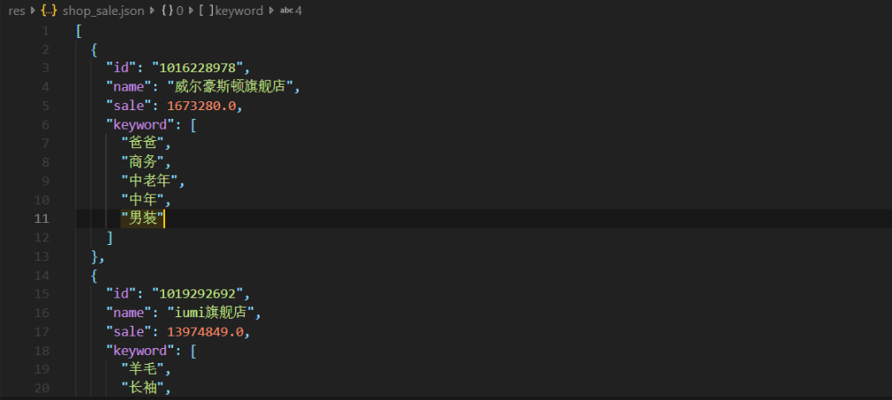
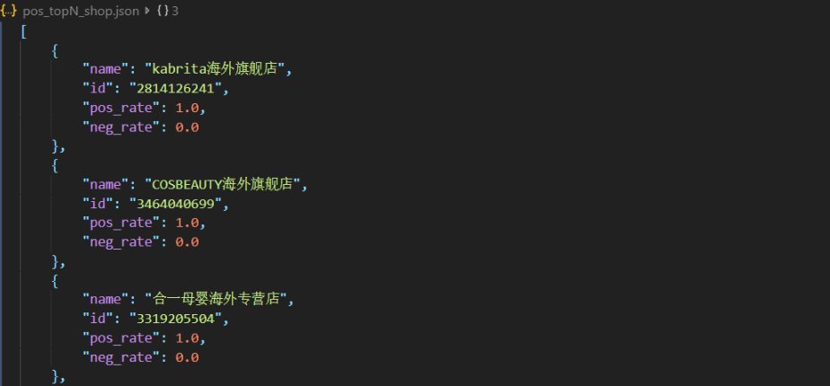
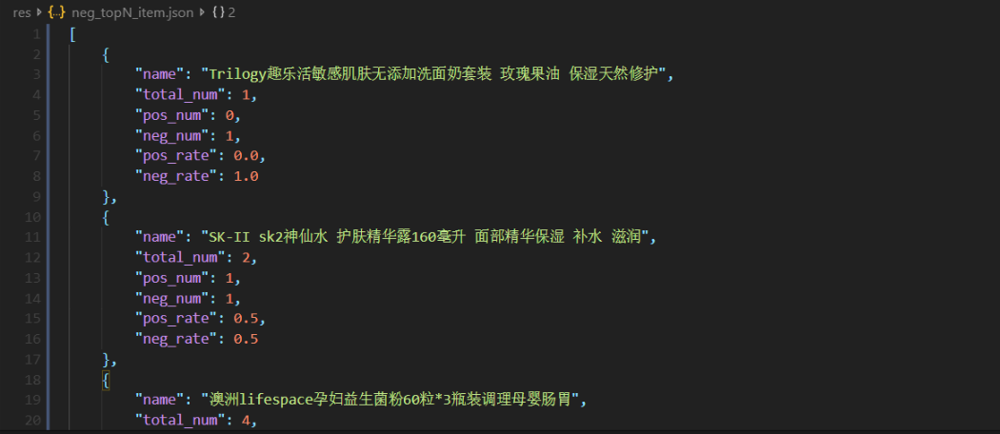

# 大数据项目三：面向淘宝数据的大数据系统构建  

陈俊儒	孙伟杰	林泽钦

[TOC]

## 概述

## 数据处理

### 1 -- 销售额统计

项目提供的数据为 json 格式，我们使用 python 进行内容提取。对于各个商品，需要提取的内容为：月销量、当前价格、邮费以及进口税。由此得到的销售额为：(当前价格 + 邮费 + 进口税) * 月销量。由于并不是每个商品都具有全部这些属性，所以当某个属性缺失的时候，我们直接设置为 0.0。此外需要注意的事项为：

__邮费__

对 json 文件进行遍历探索之后，我们发现邮费 (postage) 可能的格式为：

+ 包邮
+ 上门安装
+ 邮费：xx.xx
+ 快递：xx.xx
+ 运费：xx.xx

对于前两种，邮费应当设置为 0.0；对于其它格式，只需将数字提取出来即可。

__进口税__

商品税 (tariff) 可能的格式以及相应的处理方式为：

|             格式             |      进口税数额       |
| :--------------------------: | :-------------------: |
|     进口税: 预计xx.xx元      |        $xx.xx$        |
| 进口税: 预计xx.xx - yy.yy元  | $(xx.xx + yy.yy) / 2$ |
| 进口税: xx% 如需征收买家承担 |  $price * xx / 100$   |
|     进口税: 买家自行承担     |          $0$          |
|           商家包税           |          $0$          |
|           商家承担           |          $0$          |

下面展示了简化版本的代码。

```python
tariff_pattern_1 = re.compile(r"进口税: 预计(?P<tariff>[0-9]+.[0-9]+)元")
tariff_pattern_2 = re.compile(r"进口税: 预计(?P<tariff_low>[0-9]+.[0-9]+) - (?P<tariff_high>[0-9]+.[0-9]+)元")
tariff_pattern_3 = re.compile(r"进口税: (?P<percent>[0-9]+.[0-9]+)% 如需征收买家承担")

for file_name in files:
    file_path = r"./data/" + file_name
    with open(file_path, "r", encoding = "utf-8") as load_f:
        load_data = json.load(load_f)
    
    for i in range(0, item_num):
        # 商品名称
        if "name" in items[i]:
            item_name[i] = items[i]["name"]
        # 商品价格
        if "price" in items[i]:
            if items[i]["price"] is not None:
                item_price[i] = items[i]["price"]
        # 商品邮费
        if "postage" in items[i]:
            if r"包" in items[i]["postage"]:            # 包邮
                item_postage[i] = 0.0
            elif items[i]["postage"] == r"上门安装":    # 上门安装
                item_postage[i] = 0.0
            else:                                       # 邮费: xx.xx
                item_postage[i] = float(items[i]["postage"][4:])
        # 商品销量
        if "sales" in items[i]:
            # 月销量 xxxx件
            item_sales[i] = int(items[i]["sales"][4:-1])
        # 商品进口税
        if "tariff" in items[i]:
            # 进口税: 预计xx.xx元
            obj = tariff_pattern_1.search(items[i]["tariff"])
            if obj:
                item_tariff[i] = float(obj.group("tariff"))
            # 进口税: 预计xx.xx - xx.xx元
            obj = tariff_pattern_2.search(items[i]["tariff"])
            if obj:
                item_tariff[i] = (float(obj.group("tariff_low")) + float(obj.group("tariff_high")))/2
            # 进口税: xx% 如需征收买家承担
            obj = tariff_pattern_3.search(items[i]["tariff"])
            if obj and item_price[i] > 0:   # 价格不为空
                item_tariff[i] = item_price[i] * float(obj.group("percent")) / 100
```

最后对每个商店，我们将其所有商品销售额累加得到商店的销售额，然后保存为 json 文件以供可视化使用。部分结果展示如下：



### 10 -- 情感分析

由于数据集中的评论并没有关于评论的标签 (好评、中评、差评)，所以我们也没有办法直接根据数据集进行训练。由于数据量比较大，进行人工标注也不太现实。所以我们直接使用 snownlp 中已经训练好的情感预测模型来对评论进行分析。这个模型预测的是一条语句为正面情感的概率，根据这个概率，我们将评论划分为：

+ 好评：$p \geq 0.7$
+ 中评：$p \geq 0.4$
+ 差评：$p < 0.4$

由于省去了训练的步骤，我们所需要做的就是遍历所有评论，将结果维护在一个关于商品评价信息的表中：

| 商品名称  | 商店 id | 好评数量 | 中评数量   | 差评数量 | 好评率   | 差评率   |
| --------- | ------- | -------- | ---------- | -------- | -------- | -------- |
| item_name | shop_id | pos_num  | medium_num | neg_num  | pos_rate | neg_rate |

因此如果需要展示数据集中的好评率、差评率 topN，直接对上表执行查询即可。而当数据集有变动的时候，例如评论增加或者撤销，只需要对变动的评论进行情感分析，然后对表中的相应项进行调整。

至于商店的好评率、差评率 topN，可以通过对上表中具有相同商店 id 的商品的各类评价数量进行累加，然后计算出相应的比例，再取 topN。同样把结果保存为 json 格式以供可视化使用。例如计算得到好评率最高的 topN 商店 (部分) 为：



差评率最高的 topN 物品 (部分) 为：



## 可视化

## 总结